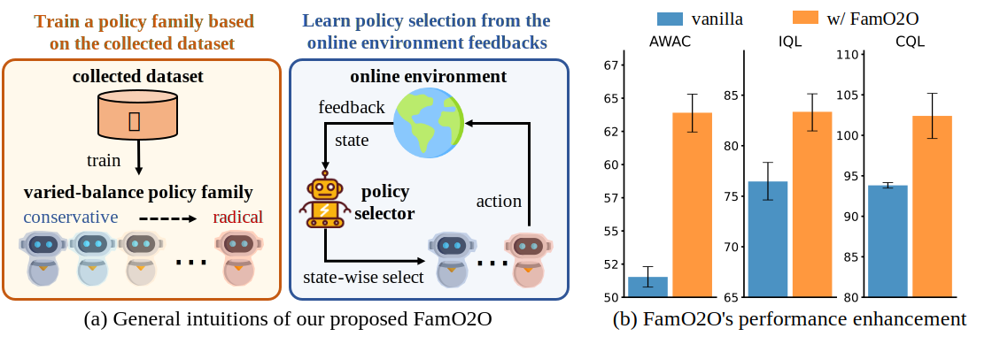

# [NeurIPS 2023 Spotlight] Train Once, Get a Family: State-Adaptive Balances for Offline-to-Online Reinforcement Learning



This repository is the official source code for *Train Once, Get a Family: State-Adaptive Balances for Offline-to-Online Reinforcement Learning* [[project page]](https://shenzhi-wang.github.io/NIPS_FamO2O/) [[NeurIPS page]](https://openreview.net/forum?id=vtoY8qJjTR), which has been accepted as a **spotlight** presentation at NeurIPS 2023. (Primary Contact: [Shenzhi Wang](https://shenzhi-wang.netlify.app/))

This codebase includes:

1. The implementation of FamO2O using JAX IQL, located in the [jax_iql folder](jax_iql/). For detailed instructions, please see the [jax_iql README](jax_iql/README.md).
2. The implementation of FamO2O using JAX CQL, located in the [jax_cql folder](jax_cql/). For additional information, please refer to the [jax_cql README](jax_cql/README.md).

We would greatly appreciate it if you could cite our work!

```
@inproceedings{
wang2023train,
title={Train Once, Get a Family: State-Adaptive Balances for Offline-to-Online Reinforcement Learning},
author={Shenzhi Wang and Qisen Yang and Jiawei Gao and Matthieu Gaetan Lin and Hao Chen and Liwei Wu and Ning Jia and Shiji Song and Gao Huang},
booktitle={Thirty-seventh Conference on Neural Information Processing Systems},
year={2023},
url={https://openreview.net/forum?id=vtoY8qJjTR}
}
```
